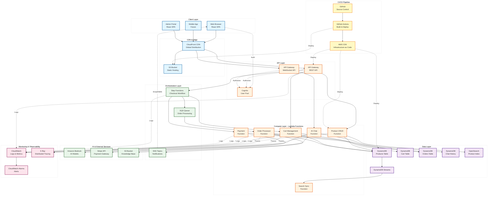

# E-Com67 Platform Architecture Diagram

## System Architecture Overview



## Component Details

### Client Layer
- **Web Browser**: React SPA with Amplify authentication
- **Mobile App**: Future mobile application support
- **Admin Portal**: Administrative interface for platform management

### CDN & Edge Layer
- **CloudFront**: Global content delivery network
- **S3 Static Hosting**: Frontend application hosting

### API Layer
- **API Gateway (REST)**: HTTP API endpoints for CRUD operations
- **API Gateway (WebSocket)**: Real-time chat communication
- **Cognito User Pool**: User authentication and authorization

### Compute Layer (Lambda Functions)
- **Product CRUD**: Product catalog management
- **Cart Management**: Shopping cart operations
- **Search Sync**: OpenSearch index synchronization
- **AI Chat**: Bedrock-powered customer support
- **Payment**: Stripe payment processing
- **Order Processor**: Asynchronous order fulfillment

### Orchestration Layer
- **Step Functions**: Checkout workflow orchestration
- **SQS**: Asynchronous order processing queue
- **SNS**: Notification distribution (email/SMS)

### Data Layer
- **DynamoDB Tables**: Products, Cart, Orders, Chat History
- **OpenSearch**: Full-text product search
- **DynamoDB Streams**: Change data capture for sync

### External Services
- **Amazon Bedrock**: AI language models
- **Stripe API**: Payment processing
- **S3 Knowledge Base**: AI training data

### Monitoring & Observability
- **CloudWatch**: Centralized logging and metrics
- **X-Ray**: Distributed request tracing
- **CloudWatch Alarms**: Automated alerting

### CI/CD Pipeline
- **GitHub**: Source code management
- **GitHub Actions**: Build automation and testing
- **AWS CDK**: Infrastructure as code deployment

## Key Data Flows

### 1. User Browse & Search Flow
```
User → CloudFront → API Gateway → Product Lambda → DynamoDB/OpenSearch → Response
```

### 2. Checkout & Payment Flow
```
User → API Gateway → Step Functions → Cart Validation → Payment Processing → SQS → Order Creation → Notifications
```

### 3. AI Chat Flow
```
User → WebSocket API → Chat Lambda → Bedrock (with S3 Knowledge Base) → Response + Chat History Storage
```

### 4. Product Update Flow
```
Admin → API Gateway → Product Lambda → DynamoDB → Streams → Search Sync Lambda → OpenSearch
```

### 5. CI/CD Deployment Flow
```
Git Push → GitHub Actions → Build & Test → CDK Synth → AWS Deployment → CloudFront Invalidation
```

## Architecture Principles

1. **Serverless-First**: All compute uses Lambda for automatic scaling
2. **Event-Driven**: Asynchronous processing via SQS, SNS, and Streams
3. **Managed Services**: Minimize operational overhead with AWS managed services
4. **Security by Design**: Cognito auth, encryption at rest/transit, least privilege IAM
5. **Observability**: Comprehensive logging, metrics, and distributed tracing
6. **Infrastructure as Code**: Complete CDK-based infrastructure management
7. **Global Distribution**: CloudFront CDN for low-latency worldwide access
8. **Resilient Design**: Retry logic, circuit breakers, and graceful degradation

## Scalability Considerations

- **Auto-scaling**: Lambda and DynamoDB scale automatically based on demand
- **Caching**: CloudFront edge caching and OpenSearch query caching
- **Database Design**: GSIs for efficient query patterns, streams for async processing
- **Queue-based Processing**: SQS decouples order processing from checkout flow
- **Search Offloading**: OpenSearch handles complex queries without impacting DynamoDB
